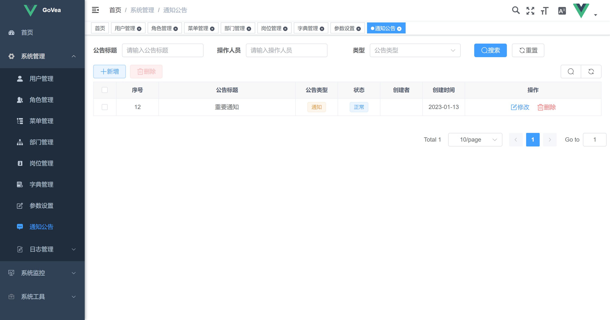

<h1 align="center" style="margin: 30px 0 30px; font-weight: bold;">GoVea v1.0.0</h1>
<h4 align="center">基于Gin+Gorm+Vue前后端分离的Go快速开发框架</h4>
<p align="center">
	<a href="https://github.com/aguoxing/go-vea"></a>
	<a href="https://github.com/aguoxing/go-vea/blob/main/LICENSE"></a>
</p>

中文 | [English](./README_en.md)

## 介绍

> [RuoYi-Vue](https://gitee.com/y_project/RuoYi-Vue)的Golang实现，Java选手的Golang奇妙之旅~

基于Gin+Gorm+Vue前后端分离的Go快速开发框架

GoVea（Go-Vue3-ElementPlus-Admin）

### 架构

**后端**

- Golang v1.19
- Gin v1.8.1
- Gorm v1.24.0

**前端**

- Vite

- Vue3

- Element-Plus

### 特性

- RESTful API
- Gin
- RBAC
- JWT认证
- ...

### 功能

- [x] 用户管理
- [x] 部门管理
- [x] 岗位管理
- [x] 菜单管理
- [x] 角色管理
- [x] 字典管理
- [x] 参数管理
- [x] 通知公告
- [ ] 操作日志
- [ ] 登录日志
- [ ] 在线用户
- [ ] 定时任务
- [ ] 代码生成
- [ ] 系统接口
- [ ] 服务监控
- [ ] 缓存监控
- [ ] 在线构建器
- [ ] 连接池监视
- [ ] ...

### 效果图

|    |    |
| ----------------------- | ----------------------- |
|    |    |
|    |    |
|  |  |

## 使用说明

> 前提：已安装好Golang、Node环境

```sh
# 克隆项目
git clone https://github.com/aguoxing/go-vea.git

# 进入项目目录
cd go-vea

# 安装go依赖
go mod tidy

# 运行后台
go run main.go

# 进入前端项目目录
cd web

# 安装前端依赖
yarn install

# 运行前端
yarn run dev
```

浏览器访问http://127.0.0.1:3000/index

## 更新日志

查看[更新日志](./CHANGELOG.md)

## 参与贡献

1. Fork 本仓库
2. 新建 dev_xxx 分支
3. 提交代码
4. 新建 Pull Request

## 开源协议

Copyright (c) 2022-present, aguoxing

Released under the [MIT License](https://github.com/aguoxing/go-vea/blob/main/LICENSE)
